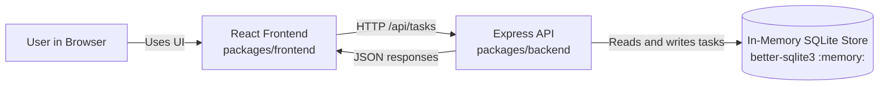
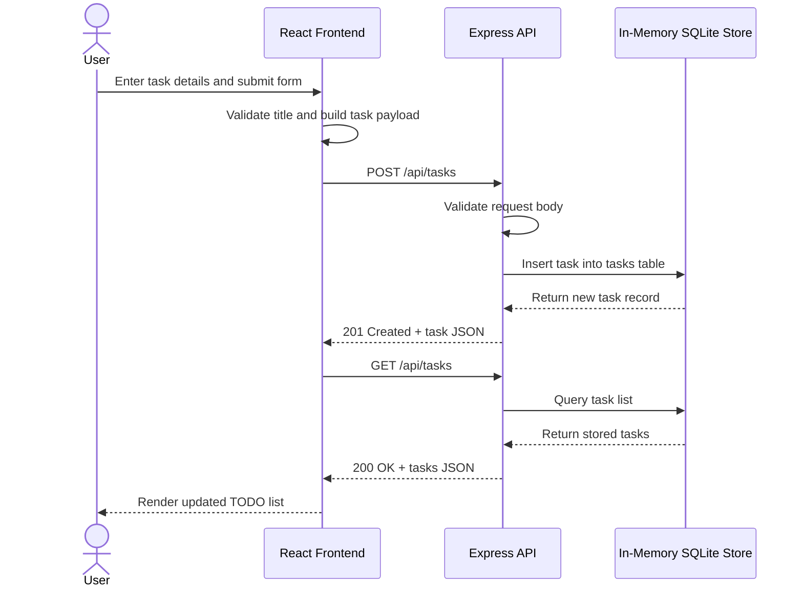

# Cloud Architecture Overview

This monorepo contains a React frontend that calls an Express API. The API uses an in-memory SQLite database for task storage during runtime.

## Notes

- The frontend is a React application served from `packages/frontend`.
- The backend is an Express service in `packages/backend`.
- Task data is stored in memory, so it resets when the backend process restarts.
- The frontend communicates with the backend through `/api/tasks` endpoints.

## Sequence: User Creates a TODO

